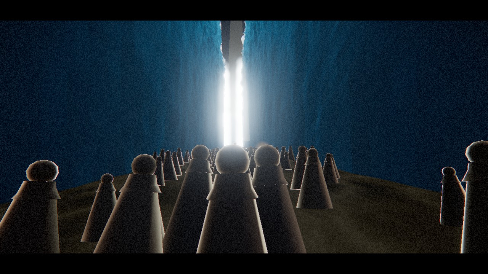

# MOSES · Parting the Sea

An immersive, cinematic 3D web experience built with **pure JavaScript and Three.js** — no build step, no frameworks, no asset downloads. You stand *inside* the fleeing crowd as the sea opens before you: two towering walls of water rise on the right hand and on the left, a pillar of light pours through the parted gap, the multitude streams forward onto the dry ground, and Pharaoh's army closes from behind.

**▶ Live:** https://dd-ching.github.io/moses-parting-the-sea/



## What's inside

Everything is generated procedurally at runtime — there are no textures or models shipped with the page.

- **Towering walls of water** — a custom GLSL shader displaces a tall, dense mesh inward with layered simplex noise: a churning foam crest, fresnel glass rim, moving caustic shimmer, and subsurface glow from the holy light at the corridor's end.
- **The parting** — a flood sheet splits down the middle and drains outward, revealing wet, glistening sea-floor with animated caustics and puddles.
- **The fleeing multitude** — hundreds of robed figures in a single `InstancedMesh`, animated on the CPU (bob / sway / forward lean) and shaded as backlit silhouettes with a crisp holy rim ahead and a warm torch rim from behind.
- **Moses** — leads the crowd, plants and raises his staff to part the sea, the tip blazing with light.
- **Pharaoh's army** — a dense host of spear-carriers lit from within by guttering torches, kicking up dust as they press toward the corridor mouth.
- **Atmosphere** — a procedural storm sky with rolling clouds and lightning, drifting mist, spray cascading down the walls, bloom, film grain, vignette, chromatic aberration, and a cinematic camera director that walks you through the whole sequence before handing you free control.
- **Sound** — a fully synthesized soundscape (Web Audio): wind, deep water rumble, crowd murmur, a drone that swells at the moment of parting, and thunder.

## Run it locally

It's a static site — any static server works:

```bash
npx serve .
# or
python -m http.server 8000
```

Then open the page and click **Enter the crowd**. Drag to look around.

## Tech

- [Three.js](https://threejs.org/) 0.160 via ES module CDN + import map
- Custom GLSL shaders (simplex noise, fbm, ridged noise)
- `EffectComposer` with `UnrealBloomPass` + a custom grade/vignette/grain pass
- The Web Audio API for the entire soundtrack

No bundler, no `node_modules`, no install — just open `index.html`.
